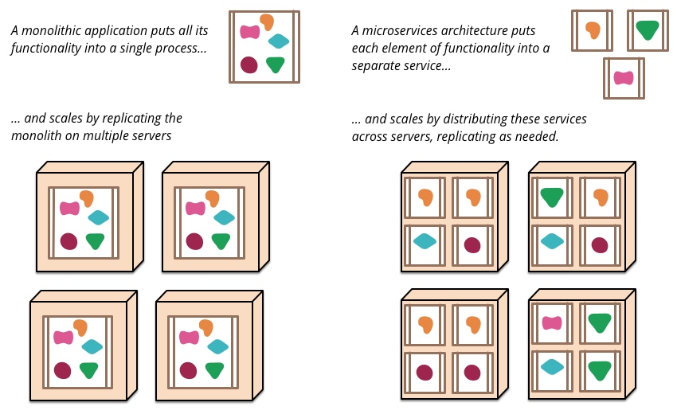
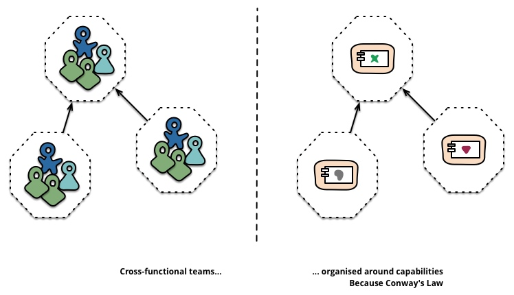
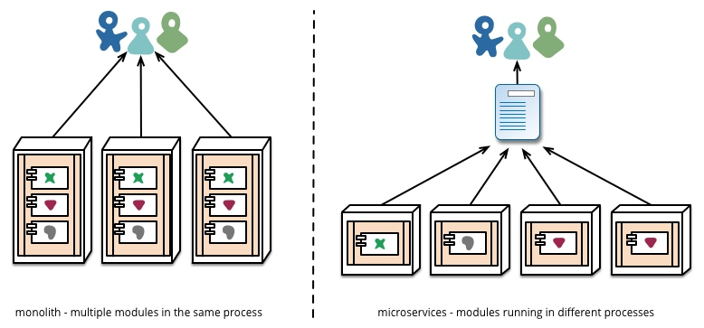

# 微服务架构的思考和认识
## What?
微服务架构是面向服务架构（SOA）的一种变体，它把应用程序设计成一系列松耦合的细粒度服务，并通过轻量级的通信协议组织起来。具体地，将应用构建成一组小型服务；这些服务都能够独立部署、独立扩展，每个服务都具有稳固的模块边界，甚至允许使用不同的编程语言来编写不同服务，也可以由不同的团队来管理维护。

                     图一

区别SOA：SOA中，服务由应用程序组件通过网络通信协议提供给其它组件；因此，微服务架构算是SOA的一种变体（特例，特指满足某些特征的SOA设计）。

## 微服务架构的特征
### 通过服务进行组件化
组件：可以理解为能够独立更换升级的软件单元，一系列组件插在一起构成软件系统。

微服务架构中，组件就是服务，通过Web服务请求或RPC之类的机制通信。

### 围绕业务功能来组织团队
微服务允许将系统根据业务功能分解成一系列服务，因此可以围绕业务功能来组织跨职能的团队，这种组织结构有利于强化服务边界。

康威定律：设计结构最终都会与组织的沟通结构相一致。

### 做产品而不是做项目
微服务架构倾向于一个产品由所属开发团队长期维护、演进，而不是项目交付后转由另一个维护团队负责；这种产品理念能够在开发团队与用户之间建立持续的关联，让开发团队关注到软件如何帮助用户增进业务功能。

### 智能端点和傻瓜式管道
通信机制上，一个典型的例子就是企业服务总结（Enterprise Service Bus），消息都流经ESB，由ESB负责消息路由、编排、转换以及业务规则的应用，随后到达端点（endpoints）进行处理，这种模式下，端点可以保持傻瓜式，因为很多逻辑都在ESB消息管道里处理了，故称之为智能管道和傻瓜式端点。

而微服务倾向于想把的做法：智能端点和傻瓜式管理；
即管道只负责在组件之间分发消息，由服务本身针对消息做相应处理。

### 去中心化技术治理
中心化技术治理最大的问题在于其局限性，统一的技术栈并不一定适用于所有场景；而在微服务背景下，每个服务单独构建，就有了选择不同技术栈的机会，允许用更适合的工具去做不同的事情，这种技术栈上的自由有助于服务独立演进，自然选择出更好的模式。

### 去中心化数据管理
从最抽象的层面看，去中心化地管理数据，意味着各个系统对客观世界所形成的概念模型各不相同。
相同的概念在两个不同的视角可能存在微妙的差异，应对这种情况的有效措施就是领域驱动设计中的界限上下文，即给模型概念限定一个上下文，在该上下文中保证概念严格一致；把一个复杂领域划分成多个界限上下文，再将其间关联勾画出来，就是概念模型层面的去中心化。
具体到数据存储上，微服务也进行了类似的去中心化策略，让每一个服务管理自己的数据库；这些数据库可以是相同数据库的不同实例，也可以是完全不同的数据库系统（混合持久化）。

### 基础设施自动化
与单体应用相比，微服务的部署要更复杂，因为在复杂的网络环境中，部署多个服务比部署一个独立应用更困难。

云计算的发展让基础设施自动化成为可能，大大降低了服务构建、部署、运维的复杂性，让我们可以复用基础设施自动化实现生产环境中的微服务管理。

### 容错设计

### 演进式设计

