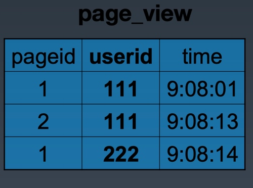

# 分析如下HiveQL，生成的MapReduce执行程序，map函数输入是什么？输出是什么，reduce函数输入是什么？输出是什么？

INSERT OVERWRITE TABLE pv_users
SELECT pv.pageid, u.age
FROM page_view pv
	JOIN user u
	ON (pv.userid = u.userid);

Page_view表和user表结构与数据示例如右

TODO