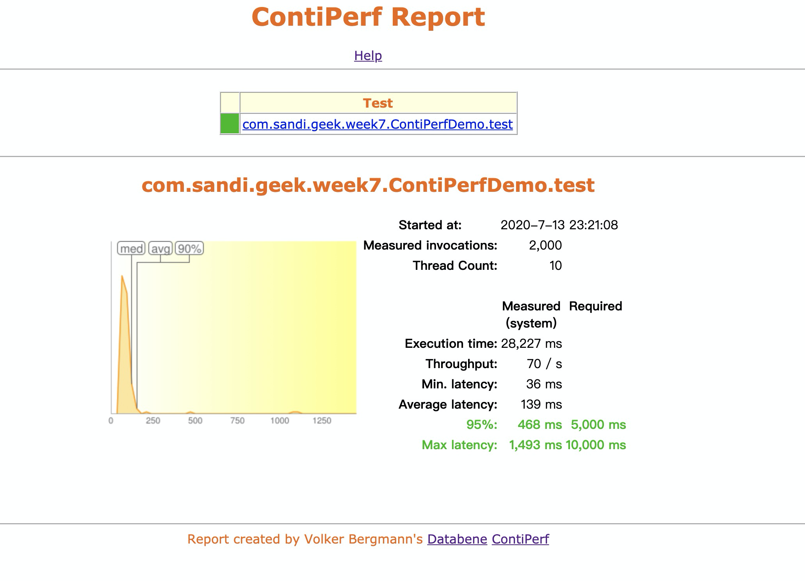

# 1、性能压测的时候，随着并发压力的增加，系统响应时间和吞吐量如何变化，为什么？
   当并发压力未到达系统瓶颈前，并发压力增加的情况下，对系统响应时间及吞吐量影响不大，当到达一定量后，系统响应时间会随着并发压力的增加而变慢；系统吞吐量会随着并发压力的增加而降低。

    示例参见：

   
    
# 2、用你熟悉的编程语言写一个web性能压测工具，输入参数：URL，请求总次数，并发数。输出参数：平均响应时间，95%响应时间。用这个测试工具以10并发、1000次请求压测www.baidu.com。
 详见代码