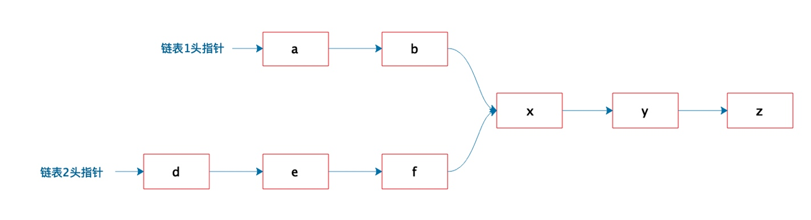

# 作业1

有两个单向链表（链表长度分别为m，n），这两个单向链表有可能在某个元素合并，如下图所示的这样，也可能不合并。现在给定两个链表的头指针，在不修改链表的情况下，如何快速地判断这两个链表是否合并？如果合并，找到合并的元素，也就是图中的 x 元素。
请用（伪）代码描述算法，并给出时间复杂度和空间复杂度。



思路：设A的长度为a+c，B的长度为b+c，其中c为尾部公共部分长度，可知：a+c+b=b+c+a.
当访问A链表的指针访问到链表尾部时，令它从链表B的头部开始访问链表B;同样地，当访问B链表的指针访问到链表尾部时，令它从链表A的头部开始访问链表A,这样就能控制访问A和B两个链表的指针能同时访问到关交点。

<<<<<<< HEAD
时间复杂度为 O(N)，空间复杂度为 O(1)。
=======
>>>>>>> f3a4445163012f3fcb91d29989e340138f939652

```
public ListNode getIntersectionNode(ListNode headA, ListNode headB) {
    ListNode l1 = headA, l2 = headB;
    while (l1 != l2) {
        l1 = (l1 == null) ? headB : l1.next;
        l2 = (l2 == null) ? headA : l2.next;
    }
    return l1;
}
