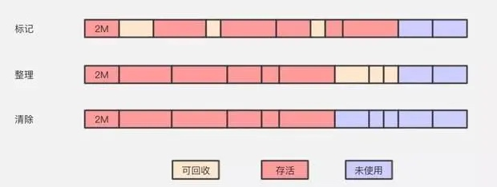

# 请简述JVM垃圾回收原理
垃圾回收（Garbage Collection，GC），顾名思义就是释放垃圾占用的空间，防止内存泄露。有效的使用可以使用的内存，对内存堆中已经死亡的或者长时间没有使用的对象进行清除和回收。

## 判断对象是否可以被回收？
1、方法一：引用计数法
    给每一个对象设置一个引用计数器，每当有一个地方引用这个对象时，就将计数器加一，引用失效时，计数器减1；当一个对象的引用计数器为0时，说明此对象没有被引用，也就是『死对象』，将会被垃圾回收。
    缺点：无法解决循环引用问题。
    
2、方法二：可达性算法（又称引用链法）
    从一个被称为GC Roots的对象开始向下搜索，如果一个对象到GC Roots没有任何引用链相连时，则说明此对象不可用。
    JAVA中可以作为GC Roots的对象有以下几种：
        *     虚拟机栈中引用的对象
        *     方法区类静态属性引用的对象
        *     方法区常量池引用的对象
        *     本地方法栈JNI引用的对象
    
    
## 垃圾回收算法
1、复制算法
    
    

    
2、标记-清除算法
    
    

    
3、标记-整理算法
    
    

4、分代收集
    
    分代收集算法分代收集算法严格来说并不是一种思想或理论，而是融合上述3种基础的算法思想，而产生的针对不同情况所采用不同算法的一套组合拳，根据对象存活周期的不同将内存划分为几块。
    在新生代中，每次垃圾收集时都发现有大批对象死去，只有少量存活，那就选用复制算法，只需要付出少量存活对象的复制成本就可以完成收集。
    在老年代中，因为对象存活率高、没有额外空间对它进行分配担保，就必须使用标记-清理算法或者标记-整理算法来进行回收。
    
## GC 类型
1、Scavenge GC
一般情况下，当新对象生成，并且在Eden申请空间失败时，就会触发Scavenge GC，对Eden区域进行GC，清除非存活对象，并且把尚且存活的对象移动到Survivor区。然后整理Survivor的两个区。这种方式的GC是对年轻代的Eden区进行，不会影响到年老代。因为大部分对象都是从Eden区开始的，同时Eden区不会分配的很大，所以Eden区的GC会频繁进行。因而，一般在这里需要使用速度快、效率高的算法，使Eden去能尽快空闲出来。

2、Full GC
对整个堆进行整理，包括Young、Tenured和Perm。Full GC因为需要对整个堆进行回收，所以比Scavenge GC要慢，因此应该尽可能减少Full GC的次数。在对JVM调优的过程中，很大一部分工作就是对于Full GC的调节。有如下原因可能导致Full GC：老年代（Tenured）被写满；持久代（Perm）被写满；System.gc()被显示调用；上一次GC之后Heap的各域分配策略动态变化；    
    
    
    
    

    
    